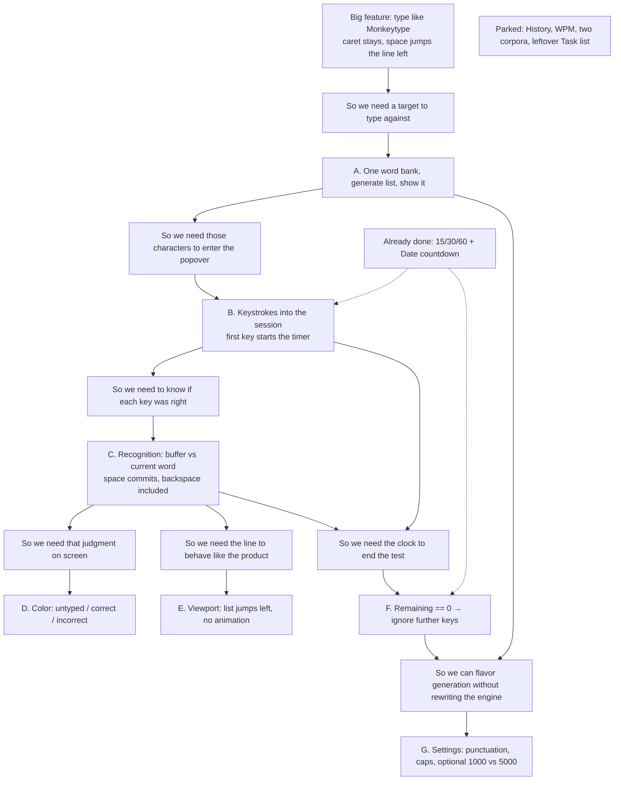
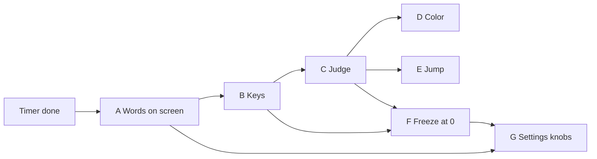
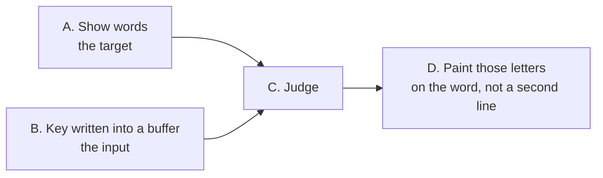

# TypeUp — slice order graphs

Open this file in Cursor and use **Markdown preview** (preview the file, not the raw source) so the diagrams render. GitHub preview also renders Mermaid.

Read **top → bottom** as “this is why we need the next box.” Dashed boxes are already done or parked.

Same chain as a straight pipeline (what you type next):

Where “show words” vs “each key is written” sit:

Slice table and rules: [CONTEXT.md](CONTEXT.md).
